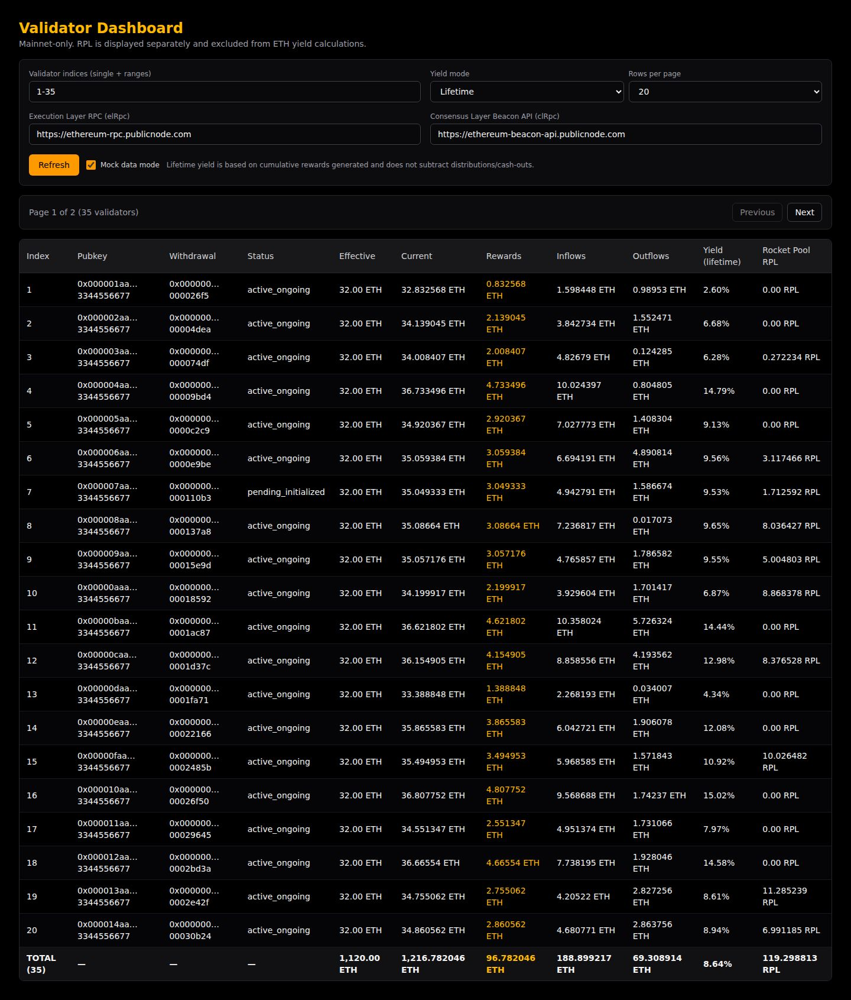

# Validator Dashboard

Static React dashboard for monitoring Ethereum validator indices on mainnet. Designed for zero-backend S3/CloudFront hosting — all data fetched client-side via RPC.



## Tech Stack

| Layer | Tool |
|---|---|
| Framework | React 19 + TypeScript (strict) |
| Build | Vite 7 |
| Styling | Tailwind CSS v4 |
| Components | shadcn/ui-style (local, CVA + tailwind-merge) |
| RPC | ethers.js v6 |
| Linting/Formatting | Biome |
| Unit Tests | Vitest + Testing Library + jsdom |
| E2E Tests | Vitest (separate config, 30s timeout) |
| Component Dev | Storybook 10 |
| Package Manager | pnpm |

## Quick Start

```bash
pnpm install
pnpm dev
```

Opens at **http://localhost:5173**

## Available Scripts

| Script | Description |
|---|---|
| `pnpm dev` | Start Vite dev server (hot reload) |
| `pnpm build` | TypeScript check + production build → `dist/` |
| `pnpm preview` | Serve the production build locally |
| `pnpm lint` | Run Biome linter across the project |
| `pnpm format` | Auto-format all files with Biome |
| `pnpm typecheck` | Run `tsc --noEmit` against `tsconfig.app.json` |
| `pnpm test` | Run unit tests (single pass) |
| `pnpm test:watch` | Run unit tests in watch mode |
| `pnpm test:e2e` | Run E2E tests (separate Vitest config, no jsdom) |
| `pnpm storybook` | Launch Storybook at **http://localhost:6006** |
| `pnpm build-storybook` | Build static Storybook site |

## Repo Structure

```
validator-dashboard/
├── public/                    # Static assets served as-is
├── src/
│   ├── main.tsx               # App entry point
│   ├── App.tsx                # Root component — DashboardPage layout
│   ├── index.css              # Tailwind imports + global styles
│   ├── types/
│   │   └── index.ts           # Shared types (ValidatorRow, ValidatorTotals, RpcConfig, etc.)
│   ├── context/
│   │   └── dashboard-context.tsx  # React context — state, query param sync, orchestration
│   ├── components/
│   │   ├── ControlsPanel.tsx      # RPC endpoints, validator input, yield mode, page size
│   │   ├── ValidatorTable.tsx     # Main data table with totals row
│   │   ├── ValidatorDetails.tsx   # Detail view for a selected validator
│   │   ├── PaginationControls.tsx # Page navigation
│   │   ├── *.stories.tsx          # Storybook stories for each component
│   │   └── ui/                    # Primitive UI components (Button, Input, Select)
│   │       └── *.stories.tsx      # Stories for primitives
│   ├── services/
│   │   ├── dashboard-orchestrator.ts  # Coordinates loading all validators
│   │   ├── rpc-service.ts             # Low-level EL/CL RPC calls
│   │   ├── validator-service.ts       # Beacon chain validator data fetching
│   │   ├── rewards-service.ts         # Reward calculation + aggregation
│   │   ├── attribution-service.ts     # Protocol detection (native/Rocket Pool/Lido)
│   │   └── __tests__/
│   │       ├── *.test.ts              # Unit tests
│   │       └── e2e/
│   │           └── *.e2e.test.ts      # E2E tests (hit real RPCs)
│   └── lib/
│       ├── format.ts          # Number/ETH formatting helpers
│       ├── mock.ts            # Mock data generator
│       ├── queryParams.ts     # URL query param read/write
│       ├── utils.ts           # General utilities (cn, etc.)
│       ├── validators.ts      # Validator input parsing (ranges, lists)
│       └── __tests__/
│           └── validators.test.ts
├── specs/
│   └── 0001-mvp-validator-dashboard.md  # Approved MVP spec
├── docs/
│   └── screenshots/
├── .storybook/
│   └── main.ts               # Storybook config (Vite framework)
├── biome.json                 # Biome linter/formatter config
├── vite.config.ts             # Vite config (not shown — standard React setup)
├── vitest.config.ts           # Unit test config (jsdom, @ alias)
├── vitest.e2e.config.ts       # E2E test config (no jsdom, 30s timeout)
├── tsconfig.json              # Base TypeScript config
├── tsconfig.app.json          # App-specific TS config
└── tsconfig.node.json         # Node/tooling TS config
```

### Path Alias

`@/` → `src/` (configured in Vite + Vitest + TypeScript)

## Configuration

All dashboard state is driven by **URL query params**, making every view bookmarkable and shareable.

### Query Params

| Param | Description | Example |
|---|---|---|
| `validators` | Comma-separated indices or ranges | `1-7,12-15,20` |
| `elRpc` | Execution-layer JSON-RPC endpoint | `https://ethereum-rpc.publicnode.com` |
| `clRpc` | Consensus-layer beacon API endpoint | `https://ethereum-beacon-api.publicnode.com` |
| `yieldMode` | Yield display window | `daily` \| `monthly` \| `annual` \| `lifetime` |
| `pageSize` | Rows per page | `20` \| `50` \| `100` |
| `page` | Current page (1-indexed) | `1` |

**Example URL:**

```
/?validators=1-7,12-15,20&elRpc=https://ethereum-rpc.publicnode.com&clRpc=https://ethereum-beacon-api.publicnode.com&yieldMode=lifetime&pageSize=20&page=1
```

### UX Behavior

- Query params populate UI fields on load
- Editing UI fields updates query params in real time (bookmarkable state)
- Totals row aggregates **all loaded validators**, not just the current page

## Yield Calculation

| Mode | Window |
|---|---|
| Daily | Rolling 24 hours |
| Monthly | Rolling 30 days |
| Annual | Rolling 365 days |
| Lifetime | Cumulative rewards vs principal |

- Distributions/outflows are treated as cash-outs and **do not** reduce lifetime yield.

## Protocol Support

| Protocol | Status |
|---|---|
| Native (solo staking) | ✅ Supported |
| Rocket Pool | ✅ RPL rewards shown separately, excluded from ETH yield |
| Lido | 🔜 Deferred to later spec |

## Build for Static Hosting (S3)

```bash
pnpm build
```

Upload `dist/` contents to your S3 static website bucket (or serve behind CloudFront). No server required — everything runs in the browser.

## Limitations (MVP)

- **Front-end only** — no backend or indexer
- **Mainnet only** — no testnet support
- Reward attribution may be partial depending on RPC capability and provided addresses
- Outflow/distribution tracking is conservative and may show `0` if not reliably derivable

## Specs

See [`specs/0001-mvp-validator-dashboard.md`](specs/0001-mvp-validator-dashboard.md) for the approved MVP scope.
